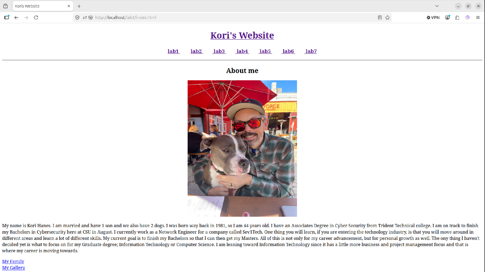

Portfolio
=========

Programming Projects
--------------------

*For access to my private project repositories, please [email me](mailto:kwhanes@student.csuniv.edu?subject=GitHub%20Access) with the subject line, GitHub Access.

---
### [Project 1 - Kori Wayne Website, all about me! | CSCI 332](project1)

-   **Source Code Repository:** [KurhyWns/csci332](https://github.com/KurhyWns/csci332) 

---
### [Project 2 - Battleship game project on the command line interface! | CSCI 235](project2)

-   **Source Code Repository:** [KurhyWns/csci235](https://github.com/KurhyWns/csci235) 

---

Ethics Papers
-------------

### [Ethics in Data Harvesting: The Importance of Informed Consent](/pdf/ethicsessay.pdf)

-   **Class: CSCI 328**  
-   **Grade:**

---

Presentations
-------------

###    

- **Class: CSCI 332** 
- **Grade:**

###    

- **Class: CSCI 332** 
- **Grade:**

---

Resume
-------------
[View my PDF](/pdf/Top_Page.pdf)   
### [Resume](/pdf/resume_APR_2026_pdf.pdf)

Page template forked from <a href="https://github.com/csu-cs/csci-portfolio">CSU-CS</a>

<!-- Remove above link if you don't want to attributive -->
