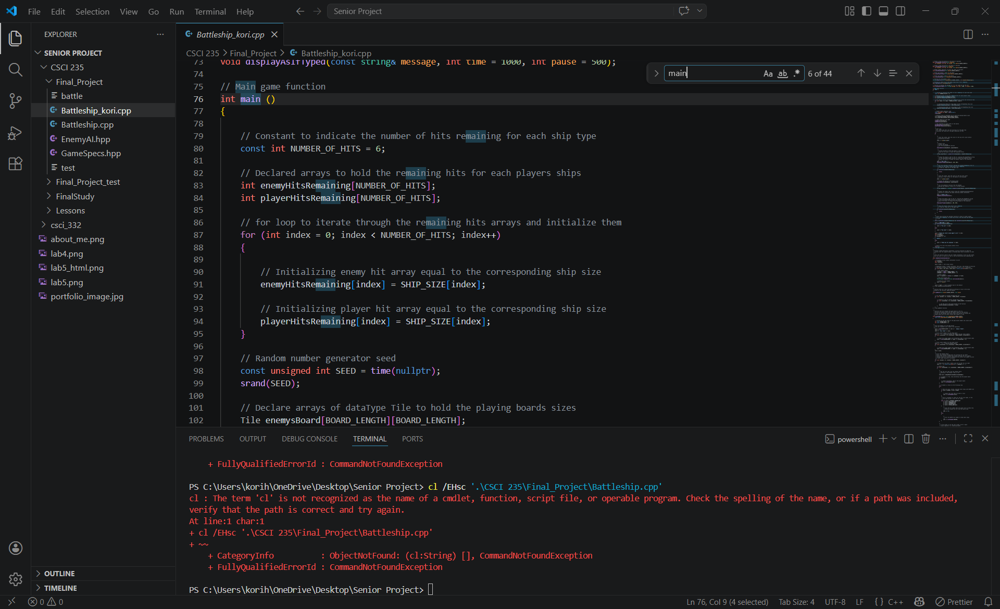
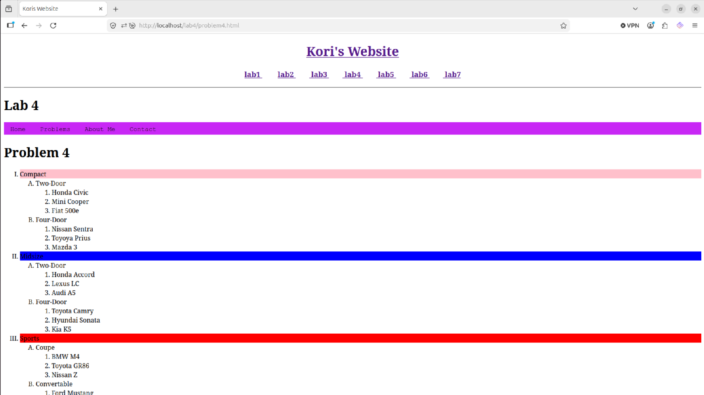
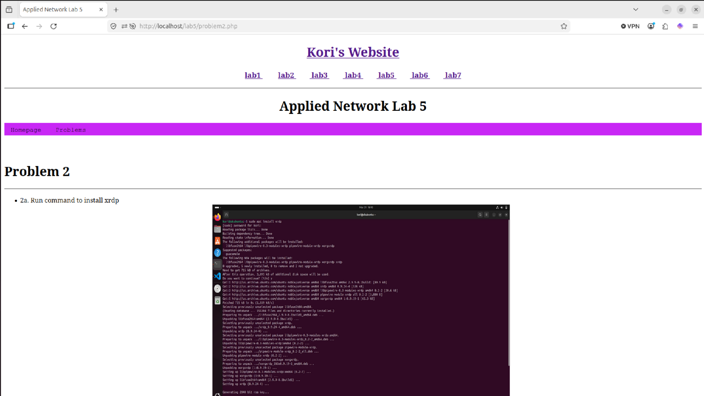
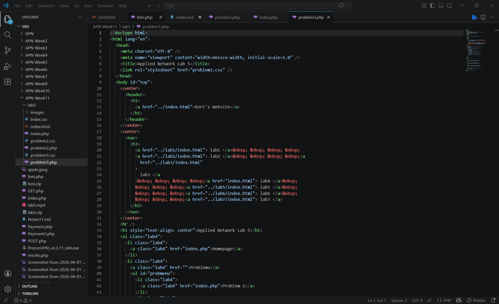

[Back to Portfolio](./)

C++ Class
===============

-   **Class: C++**
-   **Grade:** 
-   **Language(s):C++** 
-   **Source Code Repository:** [features/mastering-markdown](https://guides.github.com/features/mastering-markdown/)  
    (Please [email me](mailto:example@csustudent.net?subject=GitHub%20Access) to request access.)

## Project description

For this class our focus was programmingin the C++ language. 

## UI Design

This website showcases different elements of web development, web serving, and backend database. 
Almost every program requires user interaction, even command-line programs. Include in this section the tasks the user can complete and what the program does. You don't need to include how it works here; that information may go in the project description or in an additional section, depending on its significance.

  
Fig 1. About Me screen

  
Fig 2. Lab 4, problem 3. 

  
Fig 3. Feedback when an error occurs.

  
Fig 4. HTML code for lab5. 

## 3. Additional Considerations

Sed ut perspiciatis unde omnis iste natus error sit voluptatem accusantium doloremque laudantium, totam rem aperiam, eaque ipsa quae ab illo inventore veritatis et quasi architecto beatae vitae dicta sunt explicabo. 

For more details see [GitHub Flavored Markdown](https://guides.github.com/features/mastering-markdown/).

[Back to Portfolio](./)
