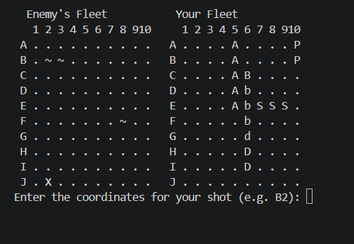
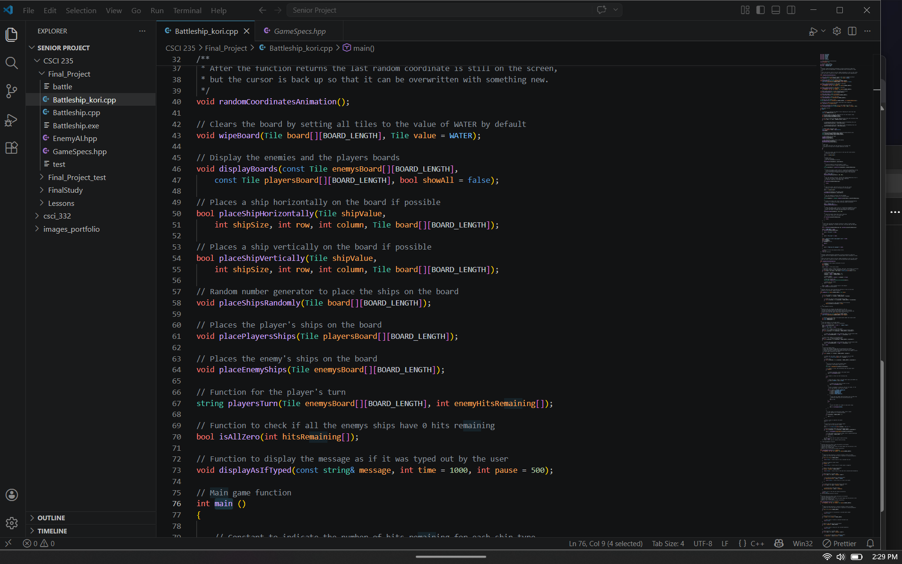

[Back to Portfolio](./)

CSCI_235 C++ Class
===============

-   **Class: C++**
-   **Grade:** 
-   **Language(s):C++** 
-   **Source Code Repository:** [KurhyWns/csci235](https://github.com/KurhyWns/csci235)  
    (Please [email me](mailto:kwhanes@student.csuniv.edu?subject=GitHub%20Access) to request access.)

## Project description

For this class our focus was programmingin the C++ language. 

## UI Design

This website showcases different elements of web development, web serving, and backend database. 
Almost every program requires user interaction, even command-line programs. Include in this section the tasks the user can complete and what the program does. You don't need to include how it works here; that information may go in the project description or in an additional section, depending on its significance.

  
Fig 1. Main function of C++ code

  
Fig 2. Print out of the game board

  
Fig 3. Various functions required to run the main function

## 3. Additional Considerations

This software was written in a programming language known as C++. C++ must go through the compilation process in order to run the software. A piece of software known as a "compiler" is used to compile the code into a format that the computer is able to read. This software is also a command-line based game. Since it is a command-line based game the software will compile and run completely in the command line interface. This will require you to install software and run commands in the command-line interface. For a Windows Operating System computer you will can use Powershell and run Powershell commands. If you are running Mac or Linux, you can use the terminal to run the commands. 
- Install compiler
    - g++ is the prefered compiler.
    - Instructions will vary based on Operating System. Please reference instructions for your OS.
- Once the compiler is installed:
    - Navigate to the folder containing the source code.
    - Compile the code using the commands for the compiler and OS you are using; for Linux the commands are
        - `g++ Battleship.cpp -o Battleship`
    - Run the compiled code using the commands for the compiler and OS you are using; for Linux the commands are
        - `./Battleship`
    - Instructions for powershell are:
        - `g++ Final_Project/Battleship.cpp -o battleship.exe`
        - `.\battleship.exe`

For more details see [GitHub Flavored Markdown](https://guides.github.com/features/mastering-markdown/).

[Back to Portfolio](./)
